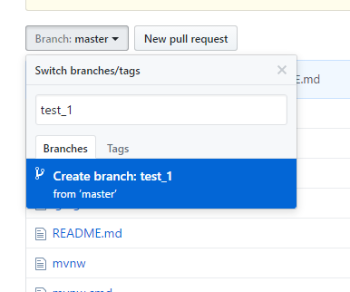

##初始化帮助文档：

####在项目下创建自己的分支:

####进入某个文件目录,clone远程代码:
git clone git@github.com:SEForMedProject/project.git

####记录与远程分支联系
cd project //进入项目
git checkout --track origin/<你的分支名>

####第一次推代码到分支
git push -u origin <你的分支名>//第一次需要设置，后面不需要，如果遇到问题(ssh key问题),那么可以修改根目录下 .git/config 文件 把对应位置做如下更改

git协议改为https协议
[remote "origin"]
		url =  https://<用户名>:密码@github.com/SEForMedProject/project.git        
		fetch = +refs/heads/*:refs/remotes/origin/*

####以后使用

写好代码之后在项目根目录
git add . //信息加到索引库 
git commit -m "your message" //依据索引库中的内容来进行提交
git pull //拉
git push //提交远程

